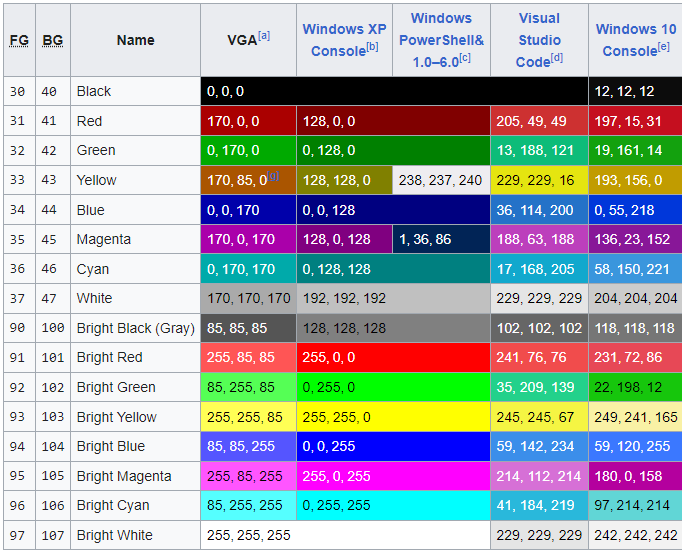
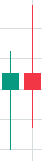

pm2 start dist/index.js --name TradDetector-FutureStock

pm install axios typescript

npm install --save-dev ts-node nodemon

npm i node-cron

npm i node-localstorage
npm i --save-dev @types/node-localstorage

Reset = "\x1b[0m"
Bright = "\x1b[1m"
Dim = "\x1b[2m"
Underscore = "\x1b[4m"
Blink = "\x1b[5m"
Reverse = "\x1b[7m"
Hidden = "\x1b[8m"

FgBlack = "\x1b[30m"
FgRed = "\x1b[31m"
FgGreen = "\x1b[32m"
FgYellow = "\x1b[33m"
FgBlue = "\x1b[34m"
FgMagenta = "\x1b[35m"
FgCyan = "\x1b[36m"
FgWhite = "\x1b[37m"
FgGray = "\x1b[90m"

BgBlack = "\x1b[40m"
BgRed = "\x1b[41m"
BgGreen = "\x1b[42m"
BgYellow = "\x1b[43m"
BgBlue = "\x1b[44m"
BgMagenta = "\x1b[45m"
BgCyan = "\x1b[46m"
BgWhite = "\x1b[47m"
BgGray = "\x1b[100m"

  let promise1 = new Promise((resolve, reject) => {
    setTimeout(() => {
      resolve("promise1");
    }, 10000);
  });

  let promise2 = new Promise((resolve, reject) => {
    setTimeout(() => {
      resolve("promise2");
    }, 1000);
  });

  Promise.all([nifty]) // , bankNifty, finNifty, midCPNifty
  .then((results) => {
    console.log("\x1b[32m");
    console.log(results[0]); // Output from promise1
    // console.log(results[1]); // Output from promise2
    // console.log(results[2]); // Output from promise3
    // console.log(results[3]); // Output from promise4
    console.log("\x1b[0m");
  })
  .catch((error) => {
    console.log(error);
  });

NIFTY 50       
NIFTY NEXT 50   
NIFTY 100
NIFTY 200
NIFTY TOTAL MARKET
NIFTY 500
NIFTY500 MULTICAP 50:25:25
NIFTY MIDCAP 150
NIFTY MIDCAP 50
NIFTY MIDCAP SELECT
NIFTY MIDCAP 100
NIFTY SMALLCAP 250
NIFTY SMALLCAP 50
NIFTY FULL SMALL CAP 100
NIFTY MICROCAP 250
NIFTY LARGEMIDCAP 250
NIFTY MIDSMALLCAP 400

++ Additional

All Future Chart

Nifty Pvt Bank

{
        "token": "12431",
        "symbol": "HDFCBANK-BL",
        "name": "HDFCBANK",
        "expiry": "",
        "strike": "-1.000000",
        "lotsize": "1",
        "instrumenttype": "",
        "exch_seg": "NSE",
        "tick_size": "5.000000"
    }

          if (tradBook.name == "NIFTY") {
            symbol = "Nifty 50";
            token = "99926000";
          } else if (tradBook.name == "NIFTYFUT") {
            symbol = "NIFTY28MAR24FUT";
            token = "36612";
          } else if (tradBook.name == "BANKNIFTY") {
            symbol = "Nifty Bank";
            token = "99926009";
          } else if (tradBook.name == "FINNIFTY") {
            symbol = "Nifty Fin Service";
            token = "99926037";
          } else if (tradBook.name == "MIDCPNIFTY") {
            symbol = "NIFTY MID SELECT";
            token = "99926074";
          }

           {
        "token": "99919000",
        "symbol": "SENSEX",
        "name": "SENSEX",
        "expiry": "",
        "strike": "0.000000",
        "lotsize": "1",
        "instrumenttype": "AMXIDX",
        "exch_seg": "BSE",
        "tick_size": "0.000000"
    },

{
        "token": "36612",
        "symbol": "NIFTY28MAR24FUT",
        "name": "NIFTY",
        "expiry": "28MAR2024",
        "strike": "-1.000000",
        "lotsize": "50",
        "instrumenttype": "FUTIDX",
        "exch_seg": "NFO",
        "tick_size": "5.000000"
    }

    {
        "token": "52222",
        "symbol": "NIFTY25APR24FUT",
        "name": "NIFTY",
        "expiry": "25APR2024",
        "strike": "-1.000000",
        "lotsize": "50",
        "instrumenttype": "FUTIDX",
        "exch_seg": "NFO",
        "tick_size": "5.000000"
    },

     {
        "token": "46930",
        "symbol": "NIFTY30MAY24FUT",
        "name": "NIFTY",
        "expiry": "30MAY2024",
        "strike": "-1.000000",
        "lotsize": "50",
        "instrumenttype": "FUTIDX",
        "exch_seg": "NFO",
        "tick_size": "5.000000"
    },

  {
        "token": "2203457",
        "symbol": "CHAMBLFERT24JUN400CE",
        "name": "CHAMBLFERT",
        "expiry": "27JUN2024",
        "strike": "40000.000000",
        "lotsize": "1900",
        "instrumenttype": "OPTSTK",
        "exch_seg": "BFO",
        "tick_size": "5.000000"
    }

        {
        "token": "132351",
        "symbol": "TATACHEM25APR241220PE",
        "name": "TATACHEM",
        "expiry": "25APR2024",
        "strike": "122000.000000",
        "lotsize": "550",
        "instrumenttype": "OPTSTK",
        "exch_seg": "NFO",
        "tick_size": "5.000000"
    }

    {
        "token": "859511",
        "symbol": "SENSEX2441275100CE",
        "name": "SENSEX",
        "expiry": "12APR2024",
        "strike": "7510000.000000",
        "lotsize": "10",
        "instrumenttype": "OPTIDX",
        "exch_seg": "BFO",
        "tick_size": "5.000000"
    },

    "symbol": "SENSEX2441275400PE"
                 YYMDD| STRIKE

sqrt root 365 | 366

= 19.10

India VIX

10.73 / 19.10 = 0.56

close market
10876.25 + 0.56%  = 10916

10876.25 - 0.56%  = 10795

//=========================== option greeks =================================
Delta = current stike delta 0.5 * index movement  = premium calculation
Gamma = Index up and down how much change in delta 
ex : Delta = 0.5 and Gamma = 0.003 and Index 100 price change up side
delth value ? =  0.003 * 100 = 0.3  means 0.5 + 0.3 = delta became = 0.8
//=========================== end option greeks =============================

PCR ( formaula = put OI / call OI )   call (buy 0.3, 0.4, 0.5) || put (buy) ( 0.5 to 0.8 )

PCR Above 1.6 = Overbought

PCR 1.60 = Excess Bullish (0.3 to 0.5)

PCR 1 Neutral

PCR 0.60 Excess Bearish (0.6 to 0.3)

PCR below 0.60 = oversold

SUNTECK
EMBDL
SOBHA
BRIGADE

remove BELOW 

GSPL

// fetchAllGainersLosers(localStorage.getItem("TradToken"), tradConfig, [
    //   GainersLosersEnum.PercPriceGainers,
    //   GainersLosersEnum.PercPriceLosers,
    // ]).then((finalList) => {
    //   console.log("Final Combined List:", finalList);

    //   if (finalList as GainersLosers[]) {
    //     var gainersLosersCollection = finalList as GainersLosers[];

    //     var value = 500;
    //     var count = 0;
    //     while (value <= gainersLosersCollection.length * 500) {
    //       loop(
    //         value,
    //         count,
    //         tradConfig,
    //         candleTimeFrame,
    //         allSymbol,
    //         gainersLosersCollection
    //       );
    //       value = value + 500;
    //       count = count + 1;
    //     }
    //   }
    // });

    , // initial placeholder
      baselineVolume: baseStockData.find(b => b.symbol === s.symbol)?.volume,
      volume: s.volume,
      volumeChangePct: s.volumeChangePct.toFixed(2)

      /var/www/html/tradingviewui/assets